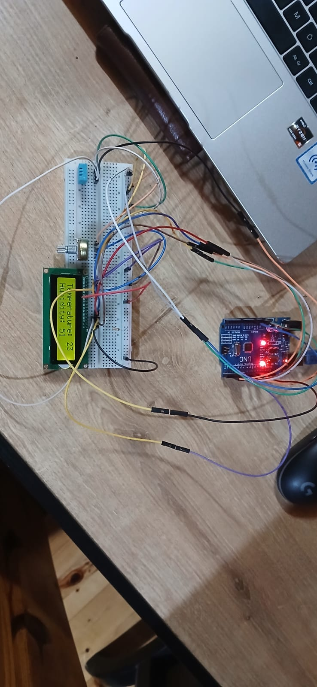

# Arduino Project 2

## Project Description
This project demonstrates how to display humidity and temperature readings on an LCD screen using an Arduino and a DHT11 sensor.

## Components Used
- 1 x Arduino Uno R3
- DHT11 Temperature and Humidity Sensor
- 1 x 10K Ohm Resistors
- 2x16 Non-illuminated LCD - Black on Green
- 10K Potansiyometre
- Jumper Wires
- Breadboard

## Circuit Photograph 


## Code
The project code is as follows:
```cpp
#include <LiquidCrystal.h>
#include <DHT11.h>

const int rs = 12, en = 11, d4 = 5, d5 = 4, d6 = 3, d7 = 2;

LiquidCrystal lcd(rs, en, d4, d5, d6, d7);
DHT11 dht11(8);

void setup() {
  lcd.begin(16, 2);
  Serial.begin(9600);
  lcd.print("Temperature: ");
  lcd.setCursor(0, 1);
  lcd.print("Humidity: ");
  lcd.setCursor(0, 0);
}

void loop() {
  int temperature = dht11.readTemperature();
  int humidity = dht11.readHumidity();

  if (temperature != DHT11::ERROR_CHECKSUM && temperature != DHT11::ERROR_TIMEOUT  &&  humidity != DHT11::ERROR_CHECKSUM && humidity != DHT11::ERROR_TIMEOUT) {
    Serial.print("Temperature: ");
    Serial.print(temperature);
    Serial.print(" °C");
    Serial.print(" [] Humidity: ");
    Serial.println(humidity);
    

    lcd.setCursor(13, 0);
    lcd.print(temperature);
    lcd.setCursor(10, 1);
    lcd.print(humidity);


    delay(10000);


    lcd.setCursor(10, 1);
    lcd.print("   ");
    lcd.setCursor(13, 0);
    lcd.print("        ");

  } else {
    // Print error message based on the error code.
    Serial.println(DHT11::getErrorString(temperature));
  }
}

```
## How to Use
Follow these steps to set up and use this project:

1. Circuit Diagram
  - Connect the components as shown in the circuit diagram:
    - DHT11 Sensor:
   
      - VCC → 5V
   
      - GND → GND
   
      - DATA → Digital Pin 2
   
    - LCD Screen:
   
      - RS → Pin 12
   
      - EN → Pin 11
   
      - D4 → Pin 5
   
      - D5 → Pin 4
   
      - D6 → Pin 3
   
      - D7 → Pin 2
   
  - Connect the potentiometer to the LCD's V0 pin to adjust contrast.

3. Upload the Code
   
4. Open the Arduino IDE.

   - Install the required libraries:

      - DHT Sensor Library: Install it from the Arduino Library Manager.

        DHT-11 Library by dhrubasaha08 (https://github.com/dhrubasaha08/DHT11)

      - LiquidCrystal Library: This comes pre-installed with the Arduino IDE.
        
        LCD Library (https://github.com/arduino-libraries/LiquidCrystal) 

      - Upload the code to your Arduino board.

5. Power the Arduino
   
   - Connect the Arduino to a power source (e.g., USB cable or external power supply).

6. Observe the Output
   
   - The LCD screen will display the current temperature and humidity readings from the DHT11 sensor.
  
   - Ensure the sensor is in an environment where temperature and humidity can be accurately measured.

7. Troubleshooting

   If the LCD screen is blank:
  
   - Check the contrast adjustment using the potentiometer.
    
   - Ensure all connections are correct and secure.

   If incorrect values are displayed:
  
   - Verify the sensor connections.
    
   - Ensure the DHT sensor is functioning properly.
